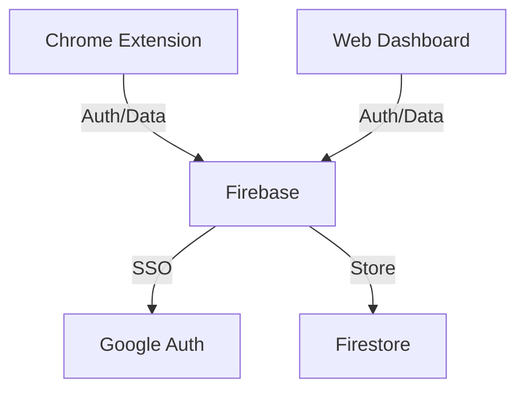
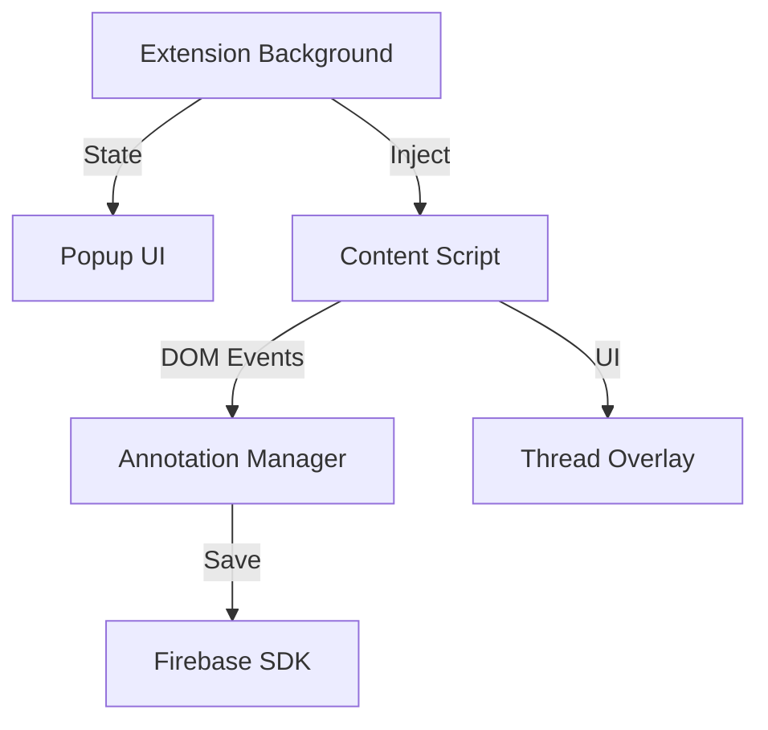
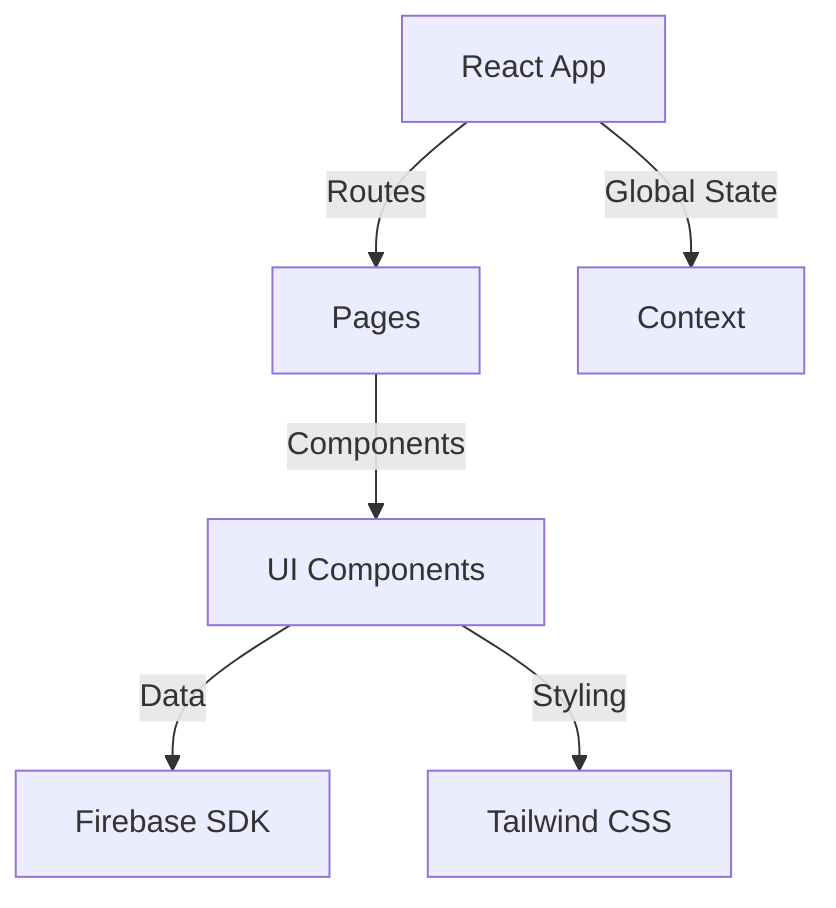
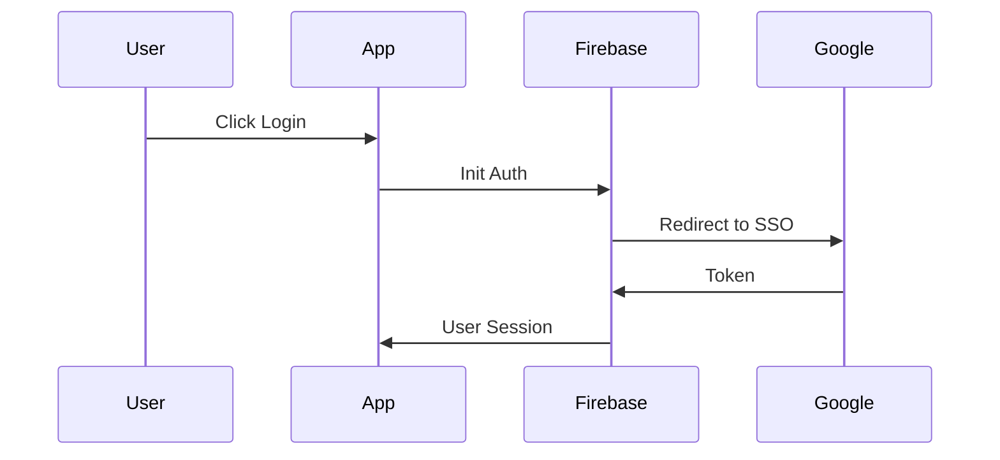
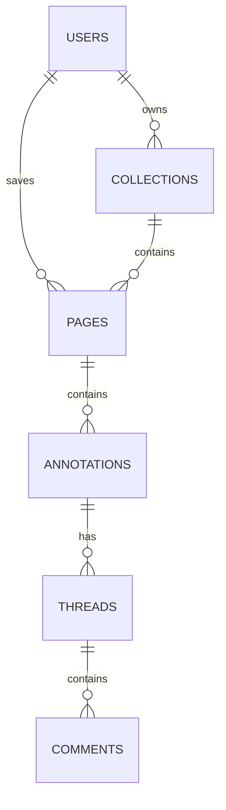
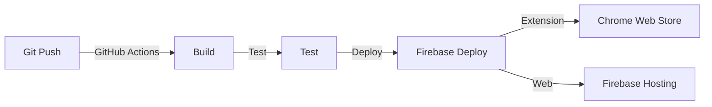

# KNotion Technical Architecture

## 1. System Overview

KNotion is a distributed web application consisting of three main components:
- Chrome Extension (client-side)
- Web Dashboard (client-side)
- Firebase Backend (serverless)



## 2. Component Architecture

### 2.1 Chrome Extension



#### Key Components:
- **Background Script**
  - Manages extension state
  - Handles authentication
  - Coordinates between popup and content scripts
  
- **Content Script**
  - Injects annotation UI
  - Manages text selection and highlighting
  - Handles DOM manipulation for overlays
  
- **Annotation Manager**
  - Uses `rangy` for text selection tracking
  - Serializes selection data
  - Manages highlight persistence
  
- **Thread Overlay**
  - Displays discussion threads
  - Manages comment UI/UX
  - Handles real-time updates

### 2.2 Web Dashboard



#### Key Components:
- **Pages**
  - Home/Feed
  - Collections
  - Thread View
  - Settings
  - Inbox

- **Core Components**
  - Navigation
  - Search
  - Thread List
  - Comment Thread
  - Tag Manager
  - Collection Manager

### 2.3 Firebase Backend

#### Authentication Flow


#### Data Model



## 3. Technical Specifications

### 3.1 Frontend Technologies

#### Chrome Extension
- Vanilla JavaScript
- Local storage for state
- Rangy for text selection
- Firebase SDK

#### Web Dashboard
- React.js
- React Router for routing
- Tailwind CSS for styling
- Context API for state management

### 3.2 Backend Services

#### Firebase Services
- Authentication (Google SSO)
- Firestore (NoSQL database)
- Hosting
- (Optional) Cloud Functions

### 3.3 Data Models

#### Core Collections

```typescript
interface User {
  id: string;
  email: string;
  displayName: string;
  photoURL?: string;
  createdAt: Timestamp;
}

interface Page {
  url: string;
  title: string;
  description?: string;
  savedBy: string;
  createdAt: Timestamp;
  tags: string[];
  collectionIds: string[];
}

interface Annotation {
  id: string;
  pageId: string;
  text: string;
  range: {
    startOffset: number;
    endOffset: number;
    containerSelector: string;
  };
  createdBy: string;
  createdAt: Timestamp;
  threadId?: string;
}

interface Thread {
  id: string;
  pageId: string;
  annotationId?: string;
  createdBy: string;
  createdAt: Timestamp;
  participants: string[];
  isPrivate: boolean;
}

interface Comment {
  id: string;
  threadId: string;
  content: string;
  authorId: string;
  createdAt: Timestamp;
  replyTo?: string;
}

interface Collection {
  id: string;
  name: string;
  description?: string;
  ownerId: string;
  members: {
    [userId: string]: 'read' | 'write' | 'admin';
  };
  createdAt: Timestamp;
}
```

## 4. Security

### 4.1 Firebase Security Rules

```javascript
rules_version = '2';
service cloud.firestore {
  match /databases/{database}/documents {
    // Users can read their own data
    match /users/{userId} {
      allow read: if request.auth.uid == userId;
      allow write: if request.auth.uid == userId;
    }
    
    // Pages are readable by anyone, writable by authenticated users
    match /pages/{pageId} {
      allow read: if true;
      allow write: if request.auth != null;
    }
    
    // Annotations and threads are controlled by page access and thread privacy
    match /threads/{threadId} {
      allow read: if resource.data.isPrivate == false || 
                   request.auth.uid in resource.data.participants;
      allow write: if request.auth != null;
    }
    
    // Collections are controlled by member access
    match /collections/{collectionId} {
      allow read: if request.auth.uid in resource.data.members;
      allow write: if request.auth.uid in resource.data.members &&
                    resource.data.members[request.auth.uid] in ['write', 'admin'];
    }
  }
}
```

## 5. Performance Considerations

### 5.1 Optimization Strategies
- Lazy loading of components and routes
- Efficient Firestore queries with proper indexing
- Client-side caching of frequently accessed data
- Debounced search and real-time updates
- Optimistic UI updates for better UX

### 5.2 Scalability
- Firestore auto-scaling
- Efficient data pagination
- Proper indexing for common queries
- Caching strategies for repeated content

## 6. Development Workflow

### 6.1 Environment Setup
- Local development environment
- Firebase emulator suite
- Chrome extension development mode
- Environment variables management

### 6.2 Deployment Pipeline


## 7. Testing Strategy

### 7.1 Test Types
- Unit tests for core functionality
- Integration tests for Firebase interactions
- E2E tests for critical user flows
- Extension-specific tests for DOM manipulation

### 7.2 Testing Tools
- Vitest for unit testing
- React Testing Library for component tests
- Cypress for E2E testing
- Chrome Extension testing utilities

## 8. Monitoring and Analytics

### 8.1 Error Tracking
- Sentry integration for error reporting
- Custom error boundaries in React
- Extension error logging

### 8.2 Analytics
- Firebase Analytics for user behavior
- Custom event tracking
- Performance monitoring

## 9. Future Considerations

### 9.1 Planned Features
- Real-time collaboration
- Offline support
- Advanced search capabilities
- Rich text editing
- Page snapshots

### 9.2 Technical Debt Management
- Regular dependency updates
- Code quality monitoring
- Performance benchmarking
- Security audits

## Tech Stack

### Frontend
- React with TypeScript for type safety
- Tailwind CSS for styling
- React Router for navigation
- React Query for data fetching and caching

### Backend
- Firebase Authentication for user management
- Cloud Firestore for data storage
- Firebase Security Rules for data protection
- Firebase Cloud Functions for serverless operations

### Testing
- Vitest for unit and integration testing
- React Testing Library for component testing
- Firebase Emulator Suite for local development and testing

### Development Tools
- ESLint for code linting
- Prettier for code formatting
- TypeScript for static type checking
- GitHub Actions for CI/CD 